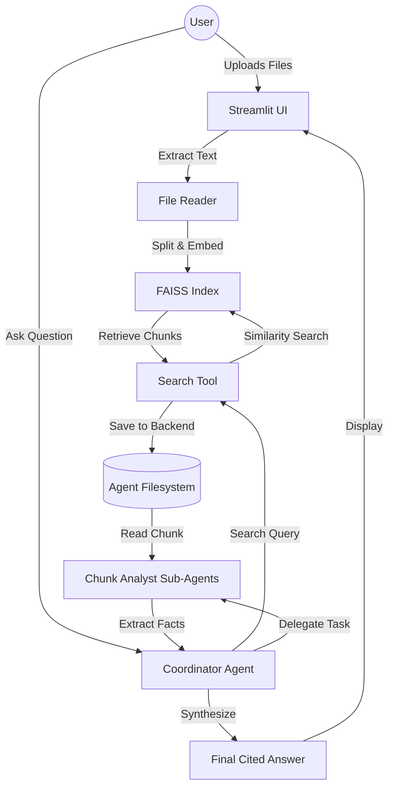

# 📚 Knowledge Agent: Multi-Agent RAG System

An advanced Retrieval-Augmented Generation (RAG) system that enables users to upload documents (PDF, TXT, MD) and receive grounded, cited answers through a coordinated multi-agent workflow.

Unlike traditional "Retrieve-then-Read" RAG pipelines, this project implements an **Agentic Map-Reduce architecture**, where a coordinator agent delegates the analysis of retrieved chunks to specialized sub-agents to ensure higher accuracy and reduce hallucination.

## 🌟 Key Features

- **Multi-Agent Orchestration**: Uses a Coordinator-Analyst pattern to decompose complex queries.
- **Grounded Citations**: Every answer is backed by specific references to the uploaded source files.
- **Persistent Vector Storage**: Implements FAISS for efficient semantic search and local index persistence.
- **Dynamic Context Management**: Only relevant chunks are passed to sub-agents, optimizing token usage and focus.
- **Modern AI Dashboard**: A professional slate-and-indigo themed UI built with Streamlit.
- **Resilient Execution**: Built-in exponential backoff to handle LLM rate limits (429 errors) automatically.

---

## 📱App UI


---

## 🏗️ Architecture

The system follows a sophisticated reasoning loop designed to handle complex documents:



### Technical Workflow:
1. **Ingestion**: Documents $\rightarrow$ Recursive Character Splitting $\rightarrow$ Local Sentence-Transformer Embeddings $\rightarrow$ FAISS Index.
2. **Planning**: The Coordinator Agent breaks down the user's question into search strategies.
3. **Retrieval**: The `search_documentation` tool fetches the top $K$ most relevant chunks.
4. **Analysis (Map)**: Each chunk is delegated to a separate `chunk-analyst` sub-agent. This prevents the "lost in the middle" phenomenon and allows parallel processing of evidence.
5. **Synthesis (Reduce)**: The Coordinator merges findings from all analysts, removes redundancies, and formats the final response with inline citations.

---

## 🛠️ Tech Stack

| Layer | Technology |
| :--- | :--- |
| **LLM** | Groq / Llama 3.1 (or other compatible OpenAI-style providers) |
| **Embeddings** | HuggingFace `all-MiniLM-L6-v2` (Local CPU) |
| **Orchestration** | DeepAgents & LangChain |
| **Vector Database** | FAISS (Facebook AI Similarity Search) |
| **Frontend** | Streamlit |
| **Language** | Python 3.12+ |
| **Dependency Mgmt** | uv |

---

## 🚀 Getting Started

### Prerequisites
- Python 3.12+
- An API Key for your chosen LLM provider (e.g., Groq (it's free and has a high limit ~30 RPM), or Google Gemini)

### Installation
1. Clone the repository:
   ```bash
   git clone https://github.com/your-username/rag-document-agent.git
   cd rag-document-agent
   ```

2. Install dependencies:
   ```bash
   uv sync
   ```

3. Set up your environment variables:
   Create a `.env` file in the root directory:
   ```env
   # Example for Groq
   GROQ_API_KEY=your_groq_api_key_here
   ```

4. Run the application:
   ```bash
   uv run streamlit run src/rag_document_agent/main.py
   ```

---

## 📈 Scalability Path

Currently, this project uses a local-first approach to maximize simplicity and privacy. For a production-scale deployment, the following migrations are recommended:

1. **Vector Database**: Migrate from **FAISS (Local)** to **ChromaDB** (for local persistence with better CRUD) or **Pinecone** (for cloud-scale multi-tenancy and millions of documents).
2. **Embeddings**: Move from local `sentence-transformers` to a hosted embedding API (like OpenAI or Cohere) to reduce local CPU load and increase embedding dimensionality.
3. **Persistence**: Replace the local `faiss_index_local` folder with a database-backed volume to support multiple concurrent users and session-isolated indices.
4. **Observability**: Integrate **LangSmith** or **Arize Phoenix** to trace agent reasoning steps and quantify retrieval accuracy.

---

## 🎓 AI Engineering Highlights

This project demonstrates the following competencies:
- **Advanced RAG**: Moving beyond naive RAG to an agentic workflow to increase precision and reduce hallucinations.
- **System Design**: Implementation of a modular architecture with a clear separation between the UI, Data, and Agent layers.
- **Context Window Optimization**: Using a filesystem-based backend for sub-agents to avoid bloating the main agent's context window.
- **Resilience Engineering**: Implementation of exponential backoff for robust API interactions.
- **State Management**: Implementing stable session handling and file-set identification in a stateful UI (Streamlit).
