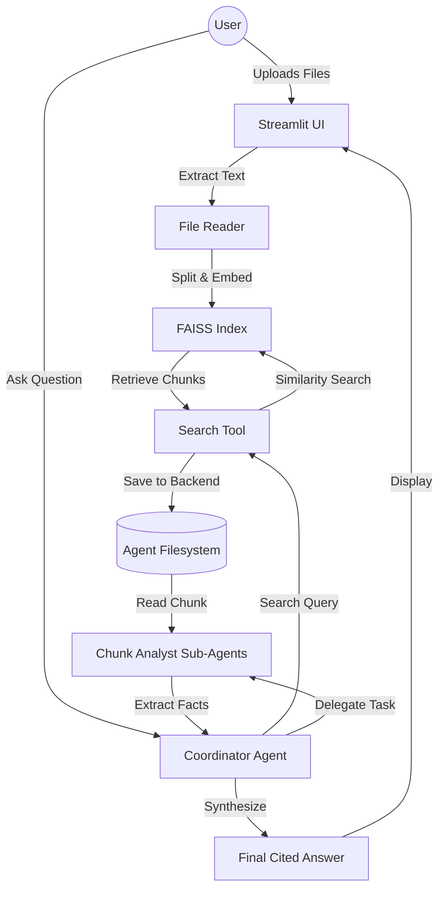

# 📚 Knowledge Agent: Multi-Agent RAG System

An advanced Retrieval-Augmented Generation (RAG) system that enables users to upload documents (PDF, TXT, MD) and receive grounded, cited answers through a coordinated multi-agent workflow.

Unlike traditional "Retrieve-then-Read" RAG pipelines, this project implements an **Agentic Map-Reduce architecture**, where a coordinator agent delegates the analysis of retrieved chunks to specialized sub-agents to ensure higher accuracy and reduce hallucination.

## 🌟 Key Features

- **Multi-Agent Orchestration**: Uses a Coordinator-Analyst pattern to decompose complex queries.
- **Grounded Citations**: Every answer is backed by specific references to the uploaded source files.
- **Persistent Vector Storage**: Implements FAISS for efficient semantic search and local index persistence.
- **Dynamic Context Management**: Only relevant chunks are passed to sub-agents, optimizing token usage and focus.
- **Modern UI**: A high-performance dashboard built with Streamlit and a custom emerald-dark theme.

---

## 🏗️ Architecture

The system follows a sophisticated reasoning loop designed to handle complex documents:



### Technical Workflow:
1. **Ingestion**: Documents $\rightarrow$ Recursive Character Splitting $\rightarrow$ Gemini Embeddings $\rightarrow$ FAISS Index.
2. **Planning**: The Coordinator Agent breaks down the user's question into search strategies.
3. **Retrieval**: The `search_documentation` tool fetches the top $K$ most relevant chunks.
4. **Analysis (Map)**: Each chunk is delegated to a separate `chunk-analyst` sub-agent. This prevents the "lost in the middle" phenomenon and allows parallel processing of evidence.
5. **Synthesis (Reduce)**: The Coordinator merges findings from all analysts, removes redundancies, and formats the final response with inline citations.

---

## 🛠️ Tech Stack

| Layer | Technology |
| :--- | :--- |
| **LLM / Embeddings** | Google Gemini 1.5 Pro / Gemini Embedding |
| **Orchestration** | DeepAgents & LangChain |
| **Vector Database** | FAISS (Facebook AI Similarity Search) |
| **Frontend** | Streamlit |
| **Language** | Python 3.12+ |
| **Dependency Mgmt** | uv |

---

## 🚀 Getting Started

### Prerequisites
- Python 3.12+
- A Google Gemini API Key

### Installation
1. Clone the repository:
   ```bash
   git clone https://github.com/your-username/rag-document-agent.git
   cd rag-document-agent
   ```

2. Install dependencies:
   ```bash
   pip install -r requirements.txt
   # OR using uv
   uv sync
   ```

3. Set up your environment variables:
   Create a `.env` file in the root directory:
   ```env
   GOOGLE_API_KEY=your_gemini_api_key_here
   ```

4. Run the application:
   ```bash
   streamlit run src/rag_document_agent/main.py
   ```

---

## 📺 Demo

**Scenario: Analyzing a Climate Change Report**
1. **Upload**: User uploads `climate_report_2024.pdf`.
2. **Question**: *"What are the three primary drivers of ocean acidification mentioned in the report?"*
3. **Agent Action**:
   - Coordinator searches for "ocean acidification drivers".
   - Retrieves 4 chunks from different pages.
   - Spawns 4 analysts to extract specific drivers from each chunk.
4. **Result**: 
   *"The primary drivers are CO2 absorption [Source: page 4], agricultural runoff [Source: page 12], and rising sea temperatures [Source: page 15]."*

---

## 🎓 AI Engineering Highlights (Portfolio)

This project demonstrates the following competencies:
- **Advanced RAG**: Moving beyond naive RAG to an agentic workflow to increase precision.
- **System Design**: Implementation of a modular architecture with a clear separation between the UI, Data, and Agent layers.
- **Context Window Optimization**: Using a filesystem-based backend for sub-agents to avoid bloating the main agent's context window.
- **State Management**: Implementing stable session handling and file-set identification in a stateful UI (Streamlit).
